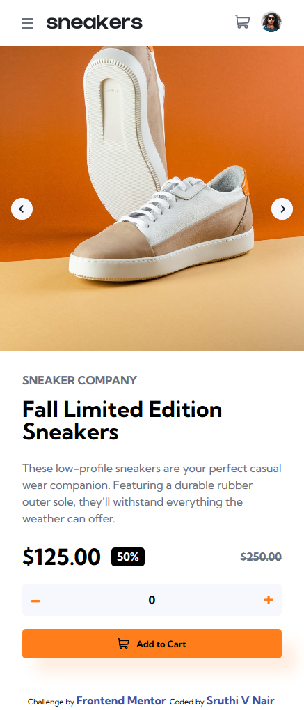
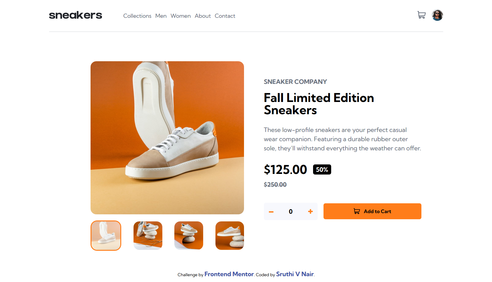

# Frontend Mentor - E-commerce product page

[This](https://sruthi-nair166.github.io/Ecommerce-Product-Page/) is a solution to the [E-commerce product page challenge on Frontend Mentor](https://www.frontendmentor.io/challenges/ecommerce-product-page-UPsZ9MJp6).

## Table of contents

- [Overview](#overview)
  - [The challenge](#the-challenge)
  - [Screenshot](#screenshot)
  - [Links](#links)
- [My process](#my-process)
  - [Built with](#built-with)
  - [What I learned](#what-i-learned)
  - [Continued development](#continued-development)
  - [Useful resources](#useful-resources)
- [Author](#author)
- [Acknowledgments](#acknowledgments)

## Overview

### The challenge

Users should be able to:

- View the optimal layout for the site depending on their device's screen size
- See hover states for all interactive elements on the page
- Open a lightbox gallery by clicking on the large product image
- Switch the large product image by clicking on the small thumbnail images
- Add items to the cart
- View the cart and remove items from it

### Screenshot

#### Mobile View

#### Desktop View

### Links

- Solution URL: [https://github.com/sruthi-nair166/Ecommerce-Product-Page](https://github.com/sruthi-nair166/Ecommerce-Product-Page)
- Live Site URL: [https://sruthi-nair166.github.io/Ecommerce-Product-Page/](https://sruthi-nair166.github.io/Ecommerce-Product-Page/)

## My process

### Built with

- Semantic HTML5 markup
- CSS custom properties
- Flexbox
- CSS Grid
- Mobile-first workflow
- JavaScript

### What I learned

Things I learned from this project are:

- Implementing cart logic: open/close, add/delete items, update quantity
- Building interactive image gallery with thumbnail selection and highlighting selected image.
- Creating a lightbox modal with prev/next navigation and synced thumbnails
- Conditionally adding and removing event listeners based on screen width (responsive behavior)
- Adding accessibility features using semantic HTML and ARIA.

### Continued development

Features I wish to add/learn about in the future:

- Implementing focus trap for modals and lightboxes
- Improving overall accessibility
- Exploring CSS transitions and animations for smoother UI interactions

### Useful resources

- [MDN Web Docs](https://developer.mozilla.org/en-US/) - Used to review syntax and revisit topics I needed a refresher on.
- [FreeCodeCamp Lesson: Learning Basic OOP by Building a Shopping Cart](https://www.freecodecamp.org/learn/javascript-algorithms-and-data-structures-v8/learn-basic-oop-by-building-a-shopping-cart/) - Revisited this lesson to refresh my understanding of cart functionality.
- [Aria Authoring Practices Guide](https://www.w3.org/WAI/ARIA/apg/) - To look up the specific aria attributes to use for this project.

## Author

- Github - [@sruthi-nair166](https://github.com/sruthi-nair166)
- Frontend Mentor - [@sruthi-nair166](https://www.frontendmentor.io/profile/sruthi-nair166)

## Acknowledgments

I would like to thank Frontend Mentor and it's availability of various projects for giving me this opportunity to be able to do this project which simulates real-world specifications.
